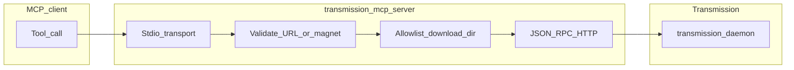

# Quickstart

Goal: run the MCP server against a **loopback-only**, **authenticated** Transmission RPC endpoint in a few minutes.

## 1. Harden Transmission (Ubuntu)

In the daemon `settings.json` (often `/etc/transmission-daemon/settings.json`):

- `"rpc-bind-address": "127.0.0.1"`
- `"rpc-authentication-required": true`
- Set `"rpc-username"` and `"rpc-password"`

Restart the service, then verify RPC is reachable only locally (example):

```bash
curl -i --user 'USER:PASS' 'http://127.0.0.1:9091/transmission/rpc' -X POST \
  -H 'Content-Type: application/json' \
  -d '{"method":"session-get","arguments":{}}'
```

You may see **409** first; the response should include `X-Transmission-Session-Id` for follow-up requests. The MCP client handles that automatically.

## 2. Build the server

```bash
cd transmission-mcp-server
npm install
npm run build
```

## 3. Set environment and run

Pick an **absolute** download directory that Transmission is allowed to use and that matches your allowlist string exactly after normalization:

```bash
export TRANSMISSION_RPC_USER='your-rpc-user'
export TRANSMISSION_RPC_PASSWORD='your-rpc-password'
export TRANSMISSION_ALLOWED_DOWNLOAD_DIRS='/var/lib/transmission-daemon/downloads'

node dist/index.js
```

If you allow **multiple** directories, also set:

```bash
export TRANSMISSION_DEFAULT_DOWNLOAD_DIR='/var/lib/transmission-daemon/downloads'
```

## 4. Wire your MCP client

Point your client at `node` and `dist/index.js`, and pass the same variables in the MCP `env` block (see [README.md](README.md)).

## 5. Sanity-check a tool

From any MCP-capable client, call **`transmission_get_session`**. If credentials or URL are wrong, you should get a clear tool error; check Transmission’s logs and stderr from the server for details.

## Diagram (overview)


