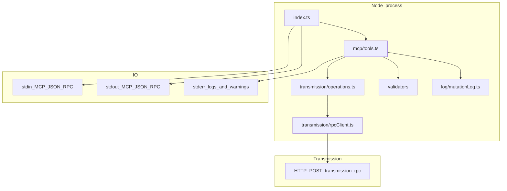
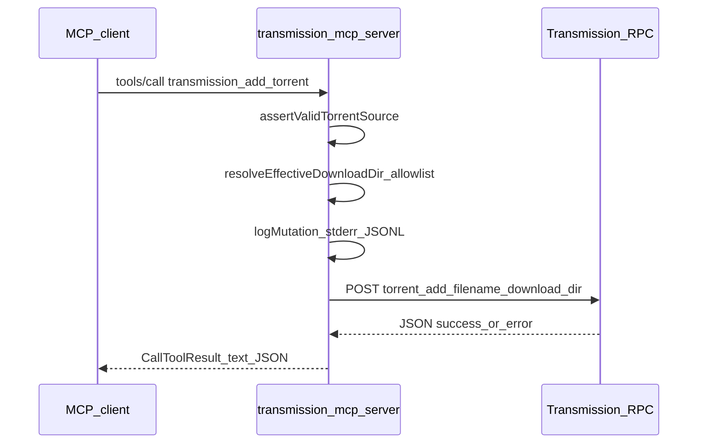

# Architecture

This project implements an MCP **stdio** server that maps a small, fixed tool surface to Transmission’s **JSON-RPC over HTTP** API.

## Component diagram

## Request sequence (example: add torrent)

## RPC client behavior

- Sends `Authorization: Basic …` on every request.
- Captures `X-Transmission-Session-Id` from a **409** response and retries once (Transmission standard behavior).
- Surfaces HTTP **401** and RPC **`result: "error"`** as tool-visible failures.

## Read vs write tools

- **Read:** `transmission_list_torrents`, `transmission_get_session` (no mutation log line).
- **Write:** `transmission_add_torrent`, `transmission_start_torrent`, `transmission_stop_torrent`, `transmission_remove_torrent` (each emits a **mutation** log line on stderr when invoked, success or failure).
