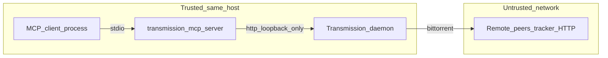

# Security model

This server is intended to sit on the **same machine** as Transmission, talking over **loopback HTTP** with **mandatory RPC authentication**. It is **not** a general-purpose remote administration bridge.

## Trust boundaries

## Requirement checklist

| # | Requirement | How it is addressed |
|---|-------------|---------------------|
| 1 | RPC bound to localhost | **You** configure Transmission `rpc-bind-address`. The server **rejects** non-loopback `TRANSMISSION_RPC` URLs (`127.0.0.1` or `::1` only). |
| 2 | RPC username/password | **Required** env vars; Basic auth on every RPC; fails fast if missing. |
| 3 | No arbitrary shell | Implementation uses **only** `fetch` to the Transmission endpoint—no `child_process`, no user-provided commands. |
| 4 | Validate URLs and magnets | `http`/`https` only for URLs; magnets must include `xt=urn:btih:` with a valid hash shape. |
| 5 | Confirm delete-local-data | `confirm_delete_local_data: true` **required** when `delete_local_data: true`. |
| 6 | Allowlist download dirs | Adds may only set `download-dir` to normalized absolute paths in `TRANSMISSION_ALLOWED_DOWNLOAD_DIRS`. |
| 7 | Log mutating actions | JSON Lines on **stderr** with `type: "transmission_mcp_mutation"` for add/start/stop/remove. |

## Logging and secrets

- **Stdout:** MCP protocol only.
- **Stderr:** warnings (session/allowlist mismatch, session probe failures) and mutation audit lines.
- Passwords and RPC secrets are **never** included in mutation payloads.

## Docker deployments

Running the server in a container does not change the trust model: it still speaks only HTTP JSON-RPC to Transmission. You must preserve **loopback-only** RPC URLs from the container’s view—typically **`network_mode: host`** on Linux. See [docker.md](docker.md).

## Operational notes

- AI clients with tool access can still **instruct Transmission to download arbitrary http(s) content** you validated as URLs—but they cannot bypass scheme checks or download-dir allowlists through this server.
- Protect the host MCP configuration: anyone who can edit client config or environment can supply RPC credentials.

